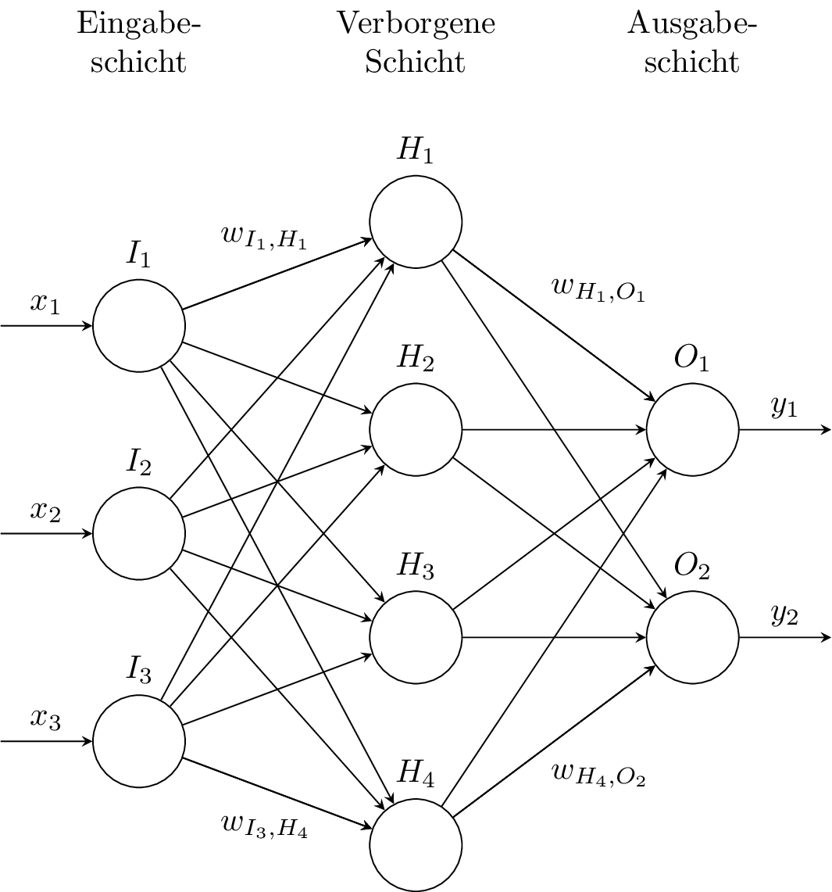
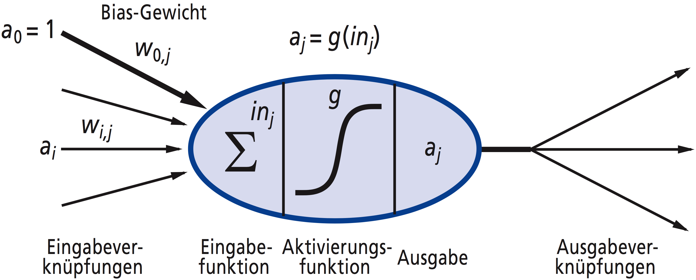
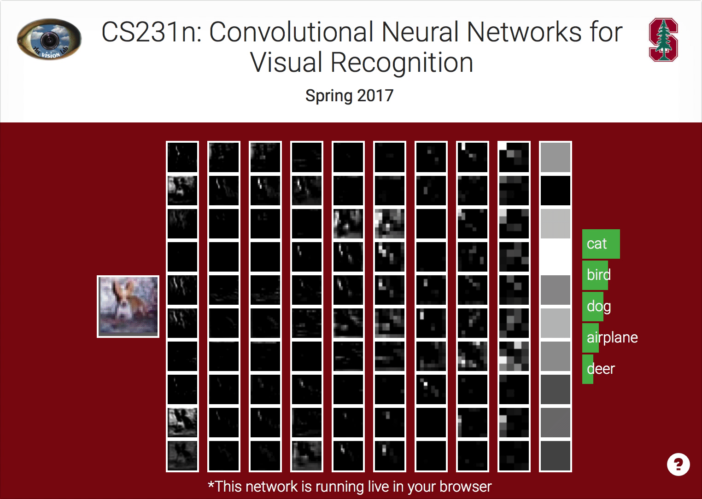
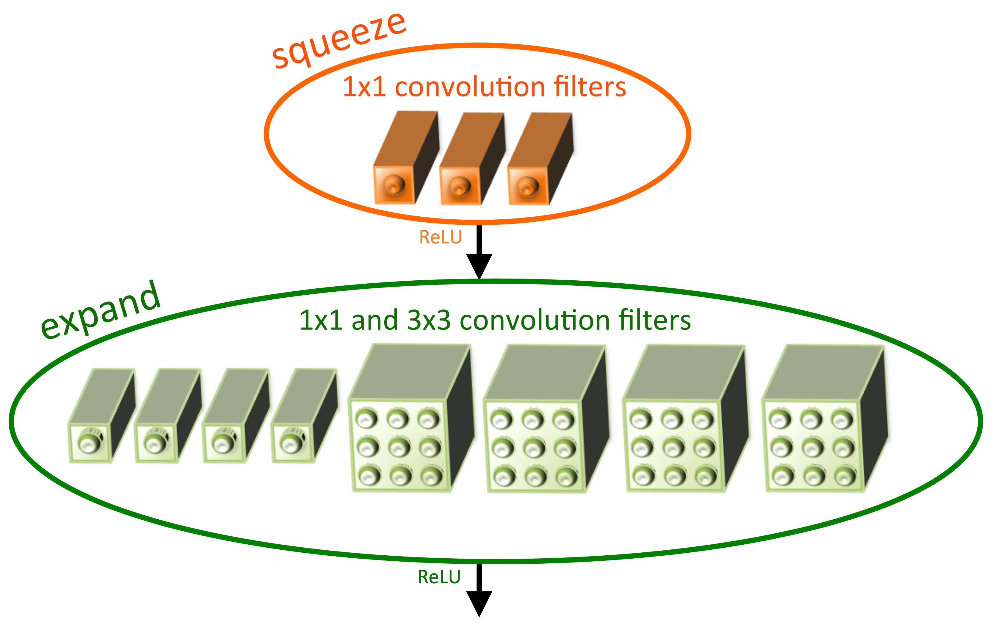

# Künstliche neuronale Netze   &   Conv-Nets

---

## KNN

<ul>
    <li class="fragment">Modellieren __nicht__ das Gehirn</li>
    <li class="fragment">Approximieren Funktionen</li>
    <li class="fragment">Nur inspiriert von natürlichen NN</li>
    <li class="fragment">Bestehen aus *Schichten von Neuronen*</li>
    <li class="fragment">Mustererkennung, Sprachsynthese, Textsynthese, etc.</li>
</ul>

Note:
- Wenig Zeit, viel Inhalt, deshalb erspare ich euch die Geschichtsstunde...

---

Note:
- Eingangsvektor y
- Ausgangsvektor x
- Können mehr Schichten haben, bei DEEP LEARNING haben sie viele Schichten
- Gewichte sind "Konfiguration" von ANNs
- Sind in echt meist größer
- Topologie variiert stark je nach Aufgabe

---

## KNN - Approximation von Funktionen

Gesucht: $y = f^*(x)$

Gefunden: $y \approx f(x,\theta) $ $:= f^3(f^2(f^1(x,\theta_1),\theta_2),\theta_3)$

$f^k = k$-te Schicht

Lernen: $\theta$ finden

Note:
Wir suchen eine Funktion

$\theta$ entscheidet was ein KNN kann und wird auch __Konfiguration__ genannt

---

## KNN - Neuron

<ul>
    <li>Auch "Einheit" oder "Unit"</li>
    <li>Hat vage etwas mit natürlichen Neuronen zu tun</li>
    <li>Linearer Klassifizierer</li>
</ul>

---

## KNN - Neuron

<small class="pull-right">[Russel & Norvig, 2012]</small>

$ a\_j = g(\sum w\_{i,j} a\_i) $

Note:
- "Mathematische" Ansicht eines Neuron

---

## KNN - Lernen

$y \approx f(x,\theta)$

$\theta$ mit niedrigen zufälligen Werten initialisiert

*Gradient Descent*

---

## Backpropagation Algorithmus

__Führt Fehler__ der Ausgabe auf verborgene Schichten __zurück__

___

---

## Backpropagation Algorithmus

$\Delta^{M}_{k} = g'(in_j) \times (y_j - a_j)$

$\Delta^{m}\_{j} = g'(in\_j) \sum\_k w\_{j,k} \Delta^{m-1}_{j}$

 👉🏻 $g$ muss differenzierbar sein

---

## KNN - Lernen

Supervised Learning

Unsupervised Learning

Reinforcement Learning

Note:
__Supervised__ Lehrer, kennt Ausgabe zu jeder Eingabe
__Unsupervised__ Mustererkennung z.B., man kennt die Ausgabe nicht, wenn es überhaupt eine gibt.
__Reinforcement__ Erfolge werden belohnt, Mißerfolge bestraft, z.B. __DOOM__

---

## KNN - Deep Learning

<ul>
    <li class="fragment">KNN mit vielen Schichten</li>
    <li class="fragment">Overfitting!</li>
    <li class="fragment">"Entwurfsmuster" wie CNNs, RNNs, etc.</li>
</ul>

---

## Convolutional Neural Networks

Note:
Merkmale in Bildern erkennen

Google: Keyword Spotting, __Small Footprint__

---

<video data-autoplay loop data-src="video/lecun_90.mp4"></video>
 
<small>[LeCun et al., 1993; http://youtu.be/FwFduRA_L6Q, 2017]</small>

Note:
- Video von LeCun der zeigt wie ein CNN Zahlen erkennt
- Demo von Arbeit von drei Jahren zuvor

---

<iframe data-src="http://cs231n.stanford.edu" frameborder="0" width="1000" height="360"></iframe>
 
<small>[http://cs231n.stanford.edu, 2017]</small>

Note:
- Jetzt kann man sowas im Browser machen
- Andrej Karpathy

___

 
<small>[http://cs231n.stanford.edu, 2017]</small>

---

## CNN

<ul>
    <li class="fragment">"Gitterartige" Inhalte</li>
    <li class="fragment">Verwendet *Convolution*</li>
    <li class="fragment">Ansonsten ähnlich zu KNN</li>
</ul>

Note:
Gitterartig, also nicht zwangsläufig Bilder

Convolution ist der Trick: Dadurch spart man eine Menge Parameter ein

---

## CNN

- Bestehen ebenfalls aus *Schichten*
- Arten von Schichten sind:
    - Input
    - Convolution
    - Activation
    - Pooling
    - Fully-Connected
    - Output

Note:
__Input:__ Eingabeschicht, beinhaltet Eingabe

__Convolution:__ Arbeiter des CNN, hier werden __Merkmale__ erkannt

__Activation:__ Beinhaletet Aktivierungen aus Conv-Layer

__Pooling:__ Verkleinert Eingabe/Datenmenge

__Fully-Connected:__ Neuronales Netz, jedes Neuron mit jedem Pixel in Eingabe verbunden

__Output:__ Ausgabe des CNN, analog zu KNN. Manchmal __Fully-Connected__

---

## CNN

 
<small>[http://cs231n.github.io/convolutional-networks/, 2017]</small>

Note:
__Bild__ vorne Eingabeschicht, dann folgen...

---

## Convolution

- Kernel

---

## Pooling

 
<small>[http://cs231n.github.io/convolutional-networks/, 2017]</small>

Note:
- Pooling um Anzahl der Parameter zu verkleinern
- und somit __Overfitting__
- Auf dem Bild: __stride=2__
- Also eine Halbierung der Maße

---

## Max-Pooling

 
<small>[http://cs231n.github.io/convolutional-networks/, 2017]</small>

Note:
- Früher Avg-Pooling
- Heute weiß man das max pooling besser ist

---

## AlexNet

<small>Krizhevsky et al., 2012</small>

<ul>
    <li class="fragment" data-fragment-index="1">Erstes CNN das die ILSVRC gewinnt (2012)</li>
    <li class="fragment" data-fragment-index="2">X Gewichte (auch *Parameter* genannt)</li>
    <li class="fragment" data-fragment-index="2">X Conv-Layer, insgesamt X Kernel</li>
    <li class="fragment" data-fragment-index="3">CNN haben Genauigkeit bei Merkmalserkennung extrem weit nach oben gedrückt</li>
    <li class="fragment" data-fragment-index="4">Gilt als Auslöser des heutigen Deep Learning Booms</li>
</ul>

---

## SqueezeNet

<small>Iandola et al., 2016</small>

<ul>
    <li class="fragment" data-fragment-index="1">"Kleines AlexNet"</li>
    <li class="fragment" data-fragment-index="2">X Parameter</li>
    <li class="fragment" data-fragment-index="2">X Conv-Layer, insgesamt X Kernel</li>
    <li class="fragment" data-fragment-index="3">X% kleiner</li>
    <li class="fragment" data-fragment-index="4">Gleiche Genauigkeit wie AlexNet</li>
    <li class="fragment" data-fragment-index="5">Fire-Modul</li>
</ul>

Note:
Kleines AlexNet weil sie sich damit verglichen 

Eine Menge revolutionäre Architekturen ausgelassen: ResNet, LeNet, etc.

---

## Fire-Module

Note:
__Module:__ Pakete von Schichten, sozusagen Kompositlayer

__Hyperparameter:__ "Konfiguration" eines Moduls, in diesem Fall z.B. Anzahl von 1x1 und 3x3 Filtern

---

## Meine Arbeit

nur Bilder hier und dann mündlich erklären was ich mache
