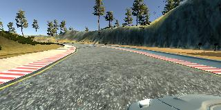
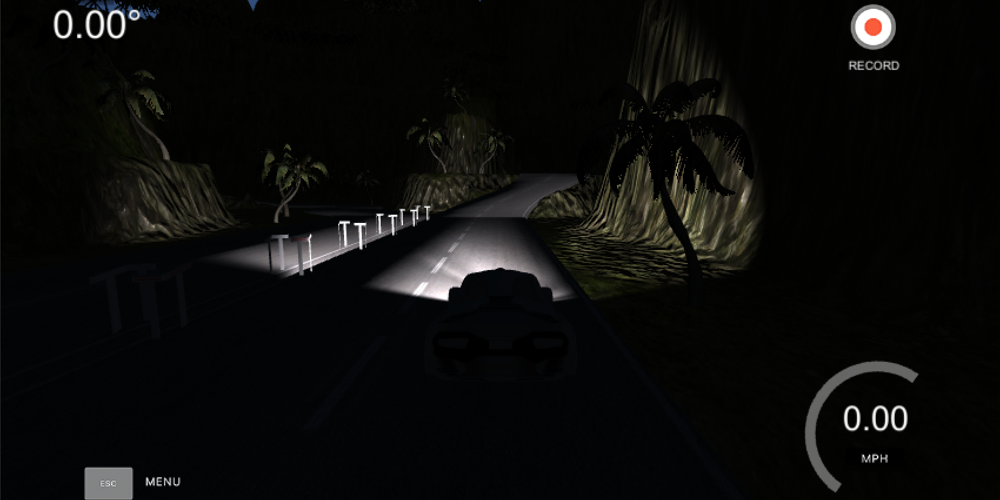
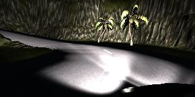

# Künstliche neuronale Netze   &   Conv-Nets

---

## Künstliche Neuronale Netze

<small class="text-muted">(KNN)</small>

Modellieren __nicht__ das Gehirn

Approximieren Funktionen

Nur inspiriert von natürlichen NN

Bestehen aus *Schichten von Neuronen*

Mustererkennung, Sprachsynthese, Textsynthese, 
etc.

---

Note:
Eingangsvektor x, Ausgangsvektor y

Können mehr Schichten haben, bei __DEEP LEARNING__ haben sie viele Schichten

Gewichte sind "Konfiguration" von ANNs

Sind in echt meist größer

Topologie variiert stark je nach Aufgabe

---

## KNN - Approximation von Funktionen

Gesucht: $y = f^*(x)$

Gefunden: $y \approx f(x,\theta) $ $:= f^3(f^2(f^1(x,\theta_1),\theta_2),\theta_3)$

$f^k = k$-te Schicht

Lernen: $\theta$ finden

Note:
Wir suchen eine Funktion $f^*$

$\theta$ entscheidet was ein KNN

---

## KNN - Neuron

Auch "Einheit"

Hat vage etwas mit natürlichen Neuronen zu tun

Linearer Klassifizierer

Note:
Lin Kl.: Aktiviert bei einer bestimmten Höhe der Eingabe

Arbeiten parallel

Kommunizieren per Ausgabeaktivierungen

---

## KNN - Neuron

<small class="pull-right">[Russel & Norvig, 2012]</small>

$ a\_j = g(\sum w\_{i,j} a\_i) $

Note:
"Mathematische" Ansicht eines Neurons

---

## KNN - Lernen

$y \approx f(x,\theta)$

$\theta$ mit niedrigen zufälligen Werten initialisiert

*Gradient Descent*

Note:
Wie bereits erwähnt $y \approx f$

Gradient Descent: Hillclimbing andersrum, suche nach minimalem Fehler

---

## Backpropagation Algorithmus

__Führt Fehler__ der Ausgabe auf verborgene Schichten __zurück__

Note:
In __mehrschichtigen__ Netzen Backprop

___

Note:
Fehler der Ausgabeschicht bekannt

Fehler von verborg. Schichten unbekannt, deshalb Backprop

Verborg. Einheiten sind __mitverantwortlich__ für Fehler an Ausgabe

__Backprop Algo erklären__ 

---

## Backpropagation Algorithmus

$\Delta^{M}_{k} = g'(in_j) \times (y_j - a_j)$

$\Delta^{m}\_{j} = g'(in\_j) \sum\_k w\_{j,k} \Delta^{m-1}_{j}$

 👉🏻 $g$ muss differenzierbar sein

Note:
Hier sieht man wie Fehler in Ausgabeschicht berechnet wird

... und dann an vorherige Schicht übertragen

---

## KNN - Lernen

Supervised Learning

Unsupervised Learning

Reinforcement Learning

Note:
__Supervised__ Lehrer, kennt Ausgabe zu jeder Eingabe
__Unsupervised__ Mustererkennung z.B., man kennt die Ausgabe nicht, wenn es überhaupt eine gibt.
__Reinforcement__ Erfolge werden belohnt, Mißerfolge bestraft, z.B. __DOOM__

---

## KNN - Deep Learning

KNN mit vielen Schichten

Overfitting Gefahr

"Entwurfsmuster" wie CNNs, RNNs, etc.

Note:
Overfitting Gefahr weil viele Parameter

---

## Convolutional Neural Networks

Note:
Merkmale in Bildern erkennen

Google: Keyword Spotting, __Small Footprint__

---

<video data-autoplay loop data-src="video/lecun_90.mp4"></video>
 
<small>[LeCun et al., 1993; http://youtu.be/FwFduRA_L6Q, 2017]</small>

Note:
- Video von LeCun der zeigt wie ein CNN Zahlen erkennt
- Demo von Arbeit von drei Jahren zuvor

---

<iframe data-src="http://cs231n.stanford.edu" frameborder="0" width="1000"></iframe>
 
<small>[http://cs231n.stanford.edu, 2017]</small>

Note:
- Jetzt kann man sowas im Browser machen
- Andrej Karpathy

___

 
<small>[http://cs231n.stanford.edu, 2017]</small>

---

## Convolutional Neural Networks

<small class="text-muted">(CNN)</small>

"Gitterartige" Inhalte

Verwendet *Convolution*

Ansonsten ähnlich zu KNN

Note:
Gitterartig, also nicht zwangsläufig nur Bilder

Woher kommt der Name

Convolution ist der Trick: Dadurch spart man eine Menge Parameter ein

---

## CNN - Aufbau

Bestehen ebenfalls aus *Schichten*

Arten von Schichten:

<ul>
    <li class="fragment">Input</li>
    <li class="fragment">Convolution</li>
    <li class="fragment">Activation</li>
    <li class="fragment">Pooling</li>
    <li class="fragment">Fully-Connected</li>
    <li class="fragment">Output</li>
</ul>

Note:
__Input:__ Eingabeschicht, beinhaltet Eingabe

__Convolution:__ Arbeiter des CNN, hier werden __Merkmale__ erkannt

__Activation:__ Beinhaletet Aktivierungen aus Conv-Layer

__Pooling:__ Verkleinert Eingabe/Datenmenge

__Fully-Connected:__ Neuronales Netz, jedes Neuron mit jedem Pixel in Eingabe verbunden

__Output:__ Ausgabe des CNN, analog zu KNN. Manchmal __Fully-Connected__

---

## CNN - Aufbau

 
<small>[http://cs231n.github.io/convolutional-networks/, 2017]</small>

Note:
__Bild__ vorne Eingabeschicht, dann folgen...

__übliche Reihenfolge in CNNs__

---

## Convolution-Layer

"Kernel" suchen nach Merkmalen im Bild

\- sind einzelne Neuronen

Kleiner Bereich des Bildes als Eingabe

Note:
Wie eingangs bereits erwaehnt ist das hier der entscheidende Teil eines CNNs. Hier befinden sich die Kernel, die die konkreten Merkmale in einem Bild erkenne.

---

## Convolution

Bereich kann z.B. sein: $3\times3\times3$

$= 27$ Gewichte für einen Kernel

$= 27$ "Pixel" aus dem Bild

Note:
__3x3__x3 könnte auch anders sein

__Aber gesamte Eingabetiefe__

Gewichte der Kernel werden so gelernt das sie ein Muster erkennen

"Pixel" zum Einen weil wir ja die Tiefe haben: D.h. die Eingabe ist __aufgeteilt in RGB__ und __drei Eingänge eines Kernel bilden__ eigentlich zusammen einen Pixel des Bildes.
Zum Anderen weil die Eingabe natürlich nicht unbedingt das Eingabebild sein muss: In späteren Schichten handelt es sich ja um die Ausgabe vorheriger Schichten und somit nicht direkt um "Pixel".

___

 
<small>[http://cs231n.github.io/convolutional-networks/, 2017]</small>

---

## Convolution

 
<small>[http://cs231n.github.io/convolutional-networks/, 2017]</small>

Note:
__Fünf__ Kernel hier im Bild

Nicht mehr als die fünf in diesem Layer, da kommt __Convolution ins Spiel__

---

## Convolution

<video data-src="video/convolution.mov" data-autoplay loop controls></video>
 
<small>[http://cs231n.github.io/convolutional-networks/, 2017]</small>

Note:
__Eigentlich 3D__

__Numpy Angaben__

__Padding__ wegen __Verkleinerung__ durch Verfahren

Ergebnis ist die Summe der elementweisen Multiplikation + Bias

___

 
<small>[http://cs231n.github.io/convolutional-networks/, 2017]</small>

---

## Pooling

 
<small>[http://cs231n.github.io/convolutional-networks/, 2017]</small>

Note:
Pooling um Anzahl der Parameter zu verkleinern

und somit __Overfitting__

Auf dem Bild: __stride=2__

Also eine Halbierung der Maße

---

## Max-Pooling

 
<small>[http://cs231n.github.io/convolutional-networks/, 2017]</small>

Note:
Früher __Avg-Pooling__

Heute weiß man das __max pooling besser__ ist

---

## AlexNet

<small>Krizhevsky et al., 2012</small>

<ul>
    <li class="fragment" data-fragment-index="1">Erstes CNN das die ILSVRC gewinnt (2012)</li>
    <li class="fragment" data-fragment-index="2">X Gewichte (auch *Parameter* genannt)</li>
    <li class="fragment" data-fragment-index="2">X Conv-Layer, insgesamt X Kernel</li>
    <li class="fragment" data-fragment-index="3">CNN haben Genauigkeit bei Merkmalserkennung extrem weit nach oben gedrückt</li>
    <li class="fragment" data-fragment-index="4">Gilt als Auslöser des heutigen Deep Learning Booms</li>
</ul>

---

## SqueezeNet

<small>Iandola et al., 2016</small>

<ul>
    <li class="fragment" data-fragment-index="1">"Kleines AlexNet"</li>
    <li class="fragment" data-fragment-index="2">X Parameter</li>
    <li class="fragment" data-fragment-index="2">X Conv-Layer, insgesamt X Kernel</li>
    <li class="fragment" data-fragment-index="3">X% kleiner</li>
    <li class="fragment" data-fragment-index="4">Gleiche Genauigkeit wie AlexNet</li>
    <li class="fragment" data-fragment-index="5">Fire-Modul</li>
</ul>

Note:
Kleines AlexNet weil sie sich damit verglichen 

Verwendung in __meiner Arbeit__

Eine Menge revolutionäre Architekturen ausgelassen: ResNet, LeNet, etc.

---

## Fire-Module

Note:
__Module:__ Pakete von Schichten, sozusagen Kompositlayer

__Hyperparameter:__ "Konfiguration" eines Moduls, in diesem Fall z.B. Anzahl von 1x1 und 3x3 Filtern

---

## Meine Arbeit

<small>SqueezeCar: Fire-Modul basierte Deep Learning Architektur für eine autonome Fahrsimulation</small>

<table>
    <tr>
        <td></td>
        <td></td>
        <td></td>
    </tr>
</table>

---

## Meine Arbeit

<small>SqueezeCar: Fire-Modul basierte Deep Learning Architektur für eine autonome Fahrsimulation</small>

<table>
    <tr>
        <td></td>
        <td></td>
        <td></td>
    </tr>
</table>

---

## Meine Arbeit

<small>SqueezeCar: Fire-Modul basierte Deep Learning Architektur für eine autonome Fahrsimulation</small>

<table>
    <tr>
        <td style="text-align:center;">Andere:</td>
        <td style="text-align:center;"></td>
        <td style="text-align:center;">Ich:</td>
    </tr>
    <tr>
        <td></td>
        <td>→</td>
        <td></td>
    </tr>
</table>
